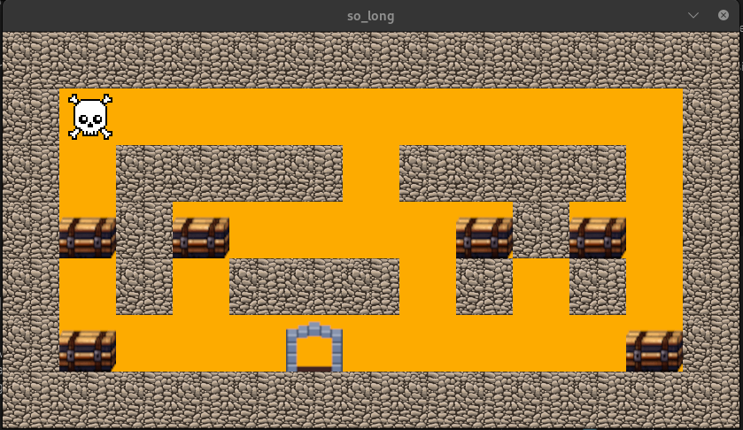

<br>
<p align="center">
  
</p>
<br>

# So Long

Welcome to the `so_long` project! This repository contains a small, yet engaging 2D game 🕹️ developed as a part of learning and demonstrating proficiency in C programming 💻 and graphical library usage, such as miniLibX. The game is built with the aim of providing a simple, fun experience while showcasing the capabilities of low-level programming in creating interactive applications.

## Introduction 🌟

`so_long` is a project that challenges players with a simple objective: collect all collectibles in a level and reach the exit 🚪. It's designed to be lightweight, portable, and accessible, focusing on the fundamentals of game development, such as rendering, event handling, and basic game logic.

## Features 🛠️

- **2D Rendering**: Utilizes miniLibX for drawing graphics and textures. 🎨
- **Simple Controls**: Move the player character using keyboard inputs. ⌨️
- **Portable Code**: Written in C for easy compilation and execution on various platforms. 🔄

## Game Info 🎯

### Map Format 🧩

Each map is a plain text file where:
- `1` represents a wall
- `0` represents an empty space
- `C` is a collectible
- `P` is the player's starting position
- `E` is the exit

Example:
```text
111111111111111
1E00C0000000001
1000P1110000001
111111111111111
```

### Controls 🎮

| KEY |	OBJECT   |
| --------- | ---------- |
| W or ⬆️        |    Move up   |
| A	or ⬅️        |    Move left |
| S	or ⬇️     |    Move down   |
| D or ➡️       |   Move para right|      
| Esc      |   Close the game     | 

<br>

## Getting Started 🚀

### Prerequisites

Before you begin, ensure you have met the following requirements:

- GCC or another C compiler installed on your system. 🧰

### Installation

Clone the repository to your local machine:

```bash
git clone git@github.com:mouracv/so_long.git
cd so_long
```
Before compiling we need to have miniLibX, so to dowload just do:

```bash
make download_mlx
```

Now to compile the game using the Makefile (assuming GNU Make is installed):

```bash
make
```
### Running the Game

After compiling, you can run the game by executing:

```bash
./so_long [path_to_map_file]
```

Replace [path_to_map_file] with the path to a valid map file. You can use one of the maps available in the `maps/` directory or provide your own custom map. 🗺️


## 👨‍💻 Author
- [GitHub](https://github.com/mouracv)
- [Linkedin](https://www.linkedin.com/in/alexsandro-moreira-2b438a347/)